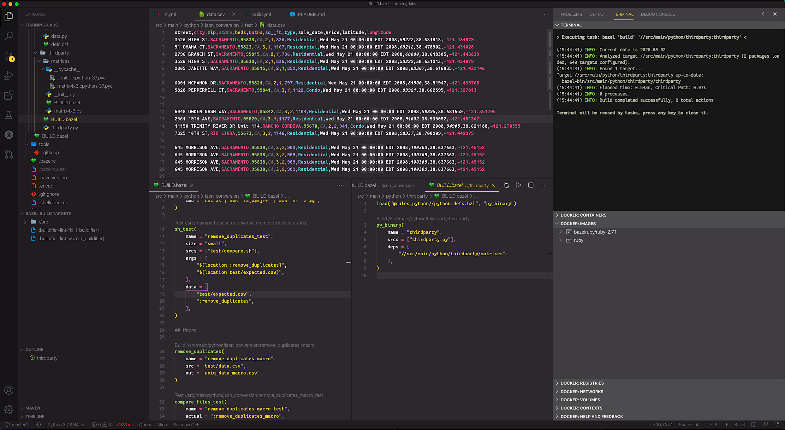

[](https://github.com/flarebuild/training-labs/actions?query=workflow%3A%22Bazel+Build+%26+Test%22)
[](https://github.com/flarebuild/training-labs/actions?query=workflow%3A%22Bazel+Lint%22)
[](https://github.com/flarebuild/training-labs/actions?query=workflow%3A%22Shell+Check%22)

# Flare Bazel Training Labs

NOTE: This is the working repo, and this Readme will be replaced eventually.

## Initial Installation

Setup is currently supported on Mac-OSX or Linux.

```
scripts/setup
```

## Buildifier Usage

### Lint

To lint with a warning only:

```
bazel run //:buildifier-lint-warn
```

### Fix

To lint and fix

```
bazel run //:buildifier-lint-fix
```

## IDEA/Bazel Integration

### Initial Import

Choose the "Import projectview" option when navigating through the "Import Bazel Project..." wizard in Jetbrains IDEs, and import project/.bazelproject. 

### Sharing Changes

Changes to .ijwb/.bazelproject are ignored; to share IDEA Bazel Plugin config with the team, edit project/.bazelproject and commit.

## Visual Studio Code Integration

Visual Studio Code has a first-class integration with Bazel, with some additional extensions that intelligently help with writing Bazel Build files. 

Below is a screenshot of this project loaded in VSCode with the Bazel support enabled, as well as the "Rainbow CSV" extension. You can see that in the Terminal the Bazel command ran and was successful.



#### In Depth

There are detailed instructions in the provided with this repo file "VSCode" [README](https://github.com/flarebuild/training-labs/blob/master/.vscode/README.md) file. Alternatively, you can follow the short version in the next section.

#### Quick VSCode Install Steps

 1. Download VSCode, install it and run it.
 2. Press ⇧⌘P (Command-Shift-P) to bring up the "Show All Commands" drop down, and search for "code". 
 3. Select `Shell Command: Install 'code' in your PATH` and press ENTER.
 4. Then, in Terminal, cd to the project's root, and:

```
cd .vscode
make install
cd -
```

## Rules_jvm_external Usage

Initial setup: 

- Add WORKSPACE entries per rules_jvm_external docs
- Invoke `bazel run @maven//:pin`
- Add the line `maven_install_json = "//:maven_install.json",` to the previously added `maven_install(...)` in the WORKSPACE
- Add `load("@maven//:defs.bzl", "pinned_maven_install")` to WORKSPACE
- Add `pinned_maven_install()` to WORKSPACE

Whenever you make a change to the list of artifacts or repositories and want to update maven_install.json, run this command to re-pin the unpinned @maven repository:

```
$ bazel run @unpinned_maven//:pin
```

Next, reference the artifacts in the BUILD file with their versionless label:

```
java_library(
    name = "java_test_deps",
    exports = [
        "@maven//:junit_junit"
        "@maven//:org_hamcrest_hamcrest_library",
    ],
)
```

Full docs can be found [here](https://github.com/bazelbuild/rules_jvm_external#usage).

